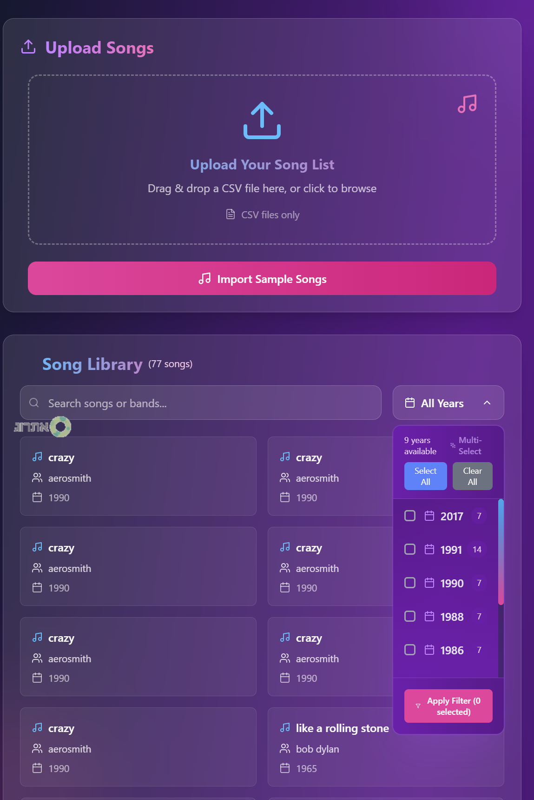
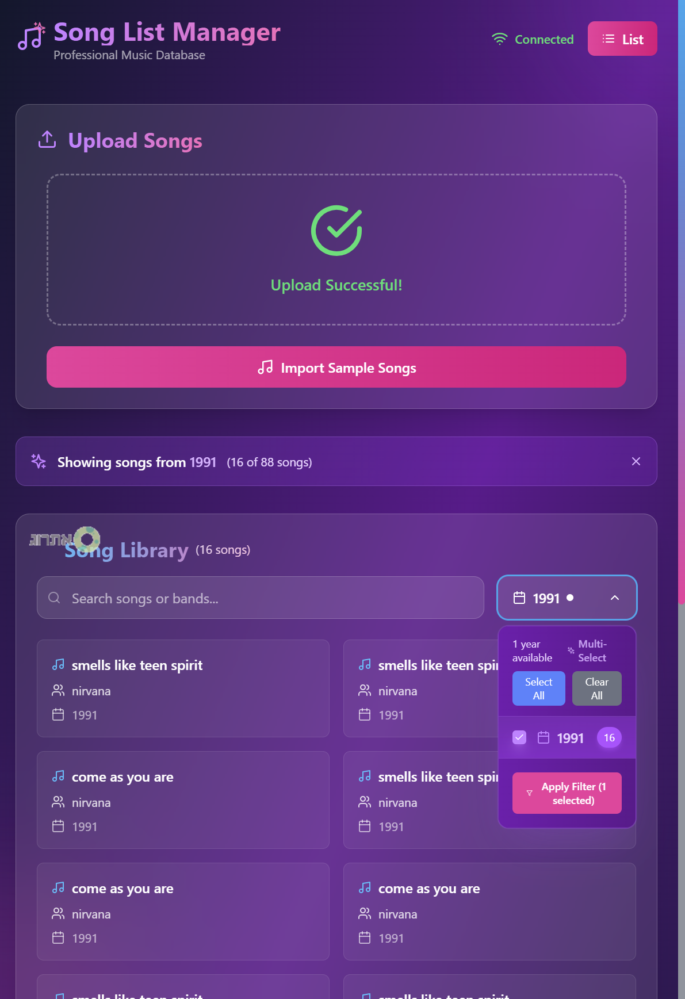

# 🎵 Song List App

A modern web application for managing song lists with CSV upload functionality.

## 🚀 Quick Start

### Prerequisites
- Docker & Docker Compose
- Supabase account

### Setup
1. Create a `.env` file with your Supabase credentials:
```bash
SUPABASE_URL=your_supabase_url
SUPABASE_KEY=your_supabase_key
```

2. Start the application:
```bash
docker-compose up --build
```

3. Access the application:
- Frontend: http://localhost
- Backend API: http://localhost:3000

## 🎯 Features

- ✅ CSV file upload with drag & drop
- ✅ Automatic lowercase conversion
- ✅ Songs table with sorting by band name
- ✅ Real-time backend status
- ✅ Modern React UI with animations
- ✅ Docker containerization

## 🛠️ Tech Stack

- **Frontend**: React + TypeScript + Vite
- **Backend**: NestJS + TypeScript
- **Database**: Supabase (PostgreSQL)
- **Styling**: CSS with modern design
- **Deployment**: Docker + Docker Compose

## 📁 Project Structure

```
├── frontend/          # React application
├── backend/           # NestJS API server
├── docker-compose.yml # Docker configuration
└── README.md         # This file
```

## 🎵 Usage

1. Upload a CSV file with columns: Song Name, Band, Year
2. All text is automatically converted to lowercase
3. Songs are displayed in a table sorted by band name
4. Use the search and filter features to find specific songs

---

**Built with ❤️ using modern web technologies**






